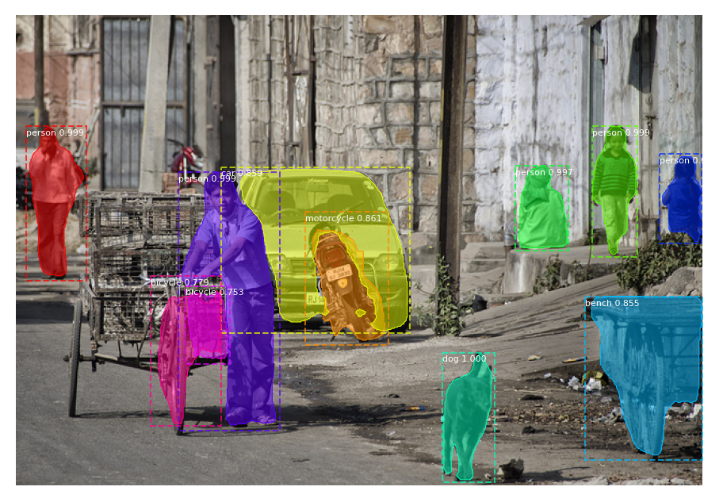

# Mask-R-CNN-Colab-Object-Detection

Source Github: https://github.com/matterport/Mask_RCNN

Tested the run on Google Colab (11-10-2020)

Count of Object from Demo: \
[17  1  1  1  1  1  4  3 14  2  2]\
Counter({1: 5, 2: 2, 17: 1, 4: 1, 3: 1, 14: 1})\
Object: dog, Quantity: 1\
Object: person, Quantity: 5\
Object: motorcycle, Quantity: 1\
Object: car, Quantity: 1\
Object: bench, Quantity: 1\
Object: bicycle, Quantity: 2
